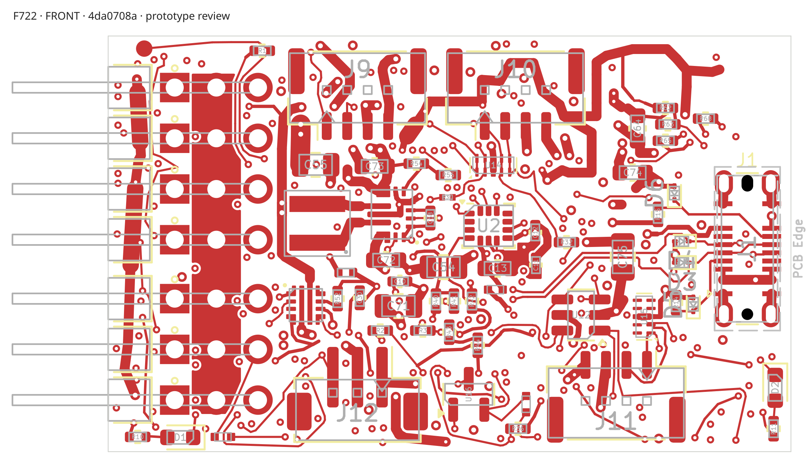
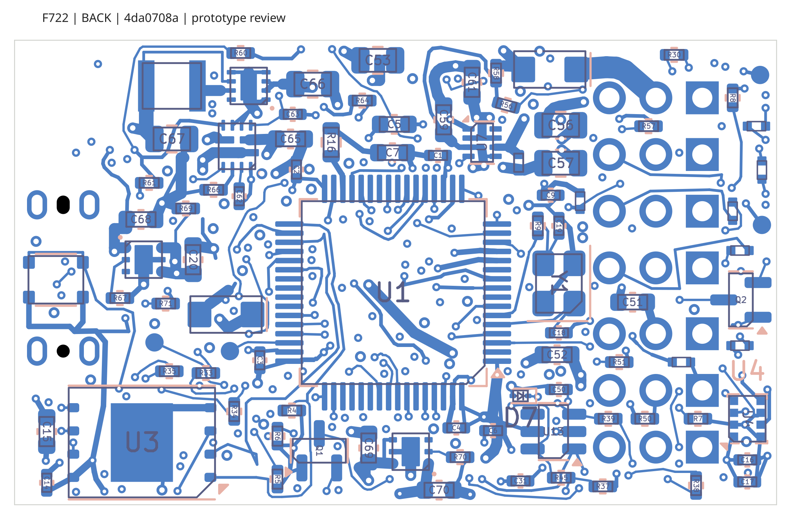

# F722 Nexus-style controller prototype

A [replacement layout is in progress](layout-revision/README.md). Its paired native checkpoint has 12 unfinished connections and is not a manufacturing release. The files described below remain the previous published prototype.

**Electrical-model correction:** the older USB and DSM path-specific modeled margins are invalid because the source model used the enable terminal instead of the supply input. The [corrected source-bound review](layout-revision/power-evidence/corrected-v3-source43/REPORT.md) applies only to its identified revised-layout board. It does not qualify the older prototype below or the newest routing checkpoint. Historical raw reports are retained for provenance.

The board is fully routed at nominal **47.5 × 25.4 mm overall**, including the direct right-angle servo contacts. It retains the Nexus firmware pinout, STM32F722RET6, ICM42688P with the reviewed CW90 mapping, W25N01GV flash and approved DPS368. USB-C opens upward; J10 and J11 have the requested consistent outward housing orientation.

**Current status: verified prototype files for CAM/assembly review.** The frozen PCB is `4da0708a4795662cc32b035a0783c70b9bdb85fc386bd4d39af33385b175667f`. Fresh KiCad 10.0.6 checks report **0 unfinished connections, 0 geometric errors, 9 unsuppressed power/ground warnings and 0 ERC violations**. All 18 scoped protection-path checks pass. Of the nine visible warnings, eight have operating-current or local copper-spreading fields in the reviewed cases; PERIPH track `874efe98` is an unloaded retained obsolete tail. Final exact-board electrical analysis and manufacturing-export verification are complete. Factory CAM/assembly acceptance and first-article qualification remain; this is not a production or flight qualification.

Open `hardware/f722-heli.kicad_pro` for the paired nine-sheet project. [Prototype handoff](docs/prototype-handoff.md) separates the CAD checks, assembly conditions and physical tests. [KST/Hobbywing setup](docs/kst-hobbywing-setup.md) records the specified servo/ESC installation and manufacturer sources. Earlier routing reports describe preserved checkpoints and do not replace this status.

The back view is mirrored for inspection; value labels are hidden in that preview only. CAD, BOM and placement data retain every actual value and orientation.

The [final electrical assessment](docs/final-electrical-review.md) separates classic DSM 20 mA, nominal DSM 0.5 A/shared ABC 2 A, and the specified Hobbywing/KST dual-feed installation. Nominal 0.5 A DSM is not a 3.3 V ±5% guarantee. Actual Hobbywing plugs, pulse duration, thermal rise and KST signal levels still require qualification; the SBEC peak label is not a 30 A board rating.

## Current versus historical evidence

The current design is the exact final95 board identified above. [Current validation status](validation/current-status.json), [prototype handoff](docs/prototype-handoff.md), [final electrical assessment](docs/final-electrical-review.md) and the current manufacturing manifest are authoritative for this revision.

Earlier schematic-development PDFs, first-article/power/sensor/passive/HV/DSM/USB narratives and older validation files may remain in the repository for provenance. They describe earlier checkpoints or unperformed test plans and are superseded wherever they conflict with the exact 4da0708a reports. Their old route counts, power margins, part alternatives, pending-work statements or proposed geometry must not be carried forward as current results. The publication update overlays current files without deleting or moving those historical records.
